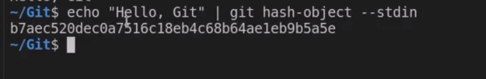

# Git-GitHub First hour

=> 1) how git is work ?
 
blob => is like a file but  blob is a thing have the file and his data  
his data( meta data ) like his name , size , type ,...ext 

so in git we use blob because when change file name he can save it without change  
the main file 

in the same explane above the tree like a blob but tree is folder bit blob is a file 

we make uniqe ID for all blobs with hashing (cha = 40 character)

to show the cha we use this =>  

in git is work with 3 tree  
1- working tree (start) 
2- staging (index) tree 
3- repo    tree (final) 

explane all detiels in next hour

