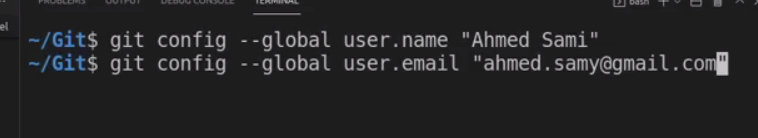
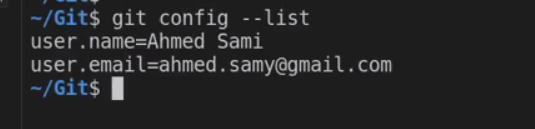

# Git-GitHub Second hour

## trees in Git

when i start in git first time should : 

 
this is to know who make change in the project  

to know the data  

 

1- working tree :- 

is a local work in your device 
to save it we must use ( add . ) to put it in staging(index) tree  

untraked => that mean the changes dosn't saved in staging tree  
the staging area is a file contain a sha 

