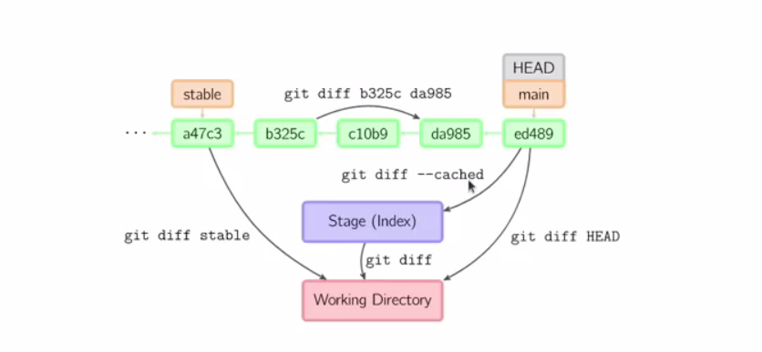

# tools 

* we use "git add ." --> to add all file and changes to staging tree   
* ~   ~  "git cinfig --list" to know data of user  
* ~   ~  "git mkdir >name of folder<" to make new folder  
* ~   ~  "git inti" to make folder to repo 
* ~   ~  "git status" to know status of files in my repo 
* ~   ~  "ls "to show content in working tree    
* ~   ~  "git ls-files "to show content in staging(index) tree    
*         =>> use -s to show with size  
*         =>> use -t to show with type  
*        =>> use -p to show with content  
*         another things in the git help  

* we can use "git status -s"==> is more simple 
* we use "git commit -m ">message<" " to commit files from staging to git with message  

* how to know the difirace between woring tree and staging tree   
by "git diff" 

* and when get diff between staging and repo
we use "git diff --staged"

* to show the diff in one step use ==>  
"git show >first 5 char from cha of commit< " we can get cha form "git log"  

* to get diff between 2 commits we use  
"git diff 'sha1'..'sha2' " 

* to make a tracked file to untracked we use   

"rm --cached >file name < " 

* to cancel a modify form file we use  
"git restore >file name <" ==> actually git is restore the file from satging 

* and use "git restore --staged >file name <" form repo  

* when i want back to another commit we use "hit reset head~>number of back <" 

then the commit will be on staginf tree but if set it direct to working tree 
we use  "--hard" 

* to make a specific commit to marked or i mean give it a name  

* we use "git tag -a > nickname < -m > short message < " and tag must be uniqe for each commit and we can move wiht it  
ex: we can use "git reset |tag| --hard " to shcange head position

 

* to show all commits we use "git log --oneline --all"
      in this feature after reset the head we can show all commits 
       but if dont use --all we show from head and down

 * to make a new branch we use "git branch >branch name < "
 * to show all branches in your repo use "git branch"
 *       and the branch than has '*' behind it is a curent branch 
 
 * to move to another branch we use "git switch >branch name < "
 * to delete specific branch use "git branch -d >branch name < "
 * to merge 2 braches first go to the merged bracnh (that i will add it ) and use 
 *   "git merge >branch name <" but !!!!!  -->  the conflict make some issue so use the       combiler to fix conflict  

 
 * to down a specific pranch and !! don't merge it we use "fetch >branch name < "
 * to down a specific pranch and !!  merge it we use "pull >branch name < "

 * to make ex (like #define in C++ ) we use "alias >name the ex <="> all things u want put it <"  "       !!!!!!! without any extra spaces 

* to rename a curent branch we use "git branch -m >new name< " 
  
* to now log for specific member  we use " git log --author="name or gemail" "

* to show the graph and pathes of logs we use "git log --all --graph"

* to edit the message of commit we use "git commit --amend"

* to show the move of head steps we use "git reflog"

* to move head forword we use that  
get reset (sha of commit) --hard { we use --hard to pull the commit from repo to working tree directed }.

* we use "git branch -vv" to show all branches and his sha

the difirance between pull and fetch :

ما الفرق بين pull و fetch في git
ChatGPT
في Git، الأمران pull وfetch يستخدمان لجلب التحديثات من المستودع البعيد، ولكن هناك فرق أساسي بينهما:

git fetch:

يقوم بجلب (fetching) جميع التغييرات من المستودع البعيد إلى المستودع المحلي الخاص بك، ولكنه لا يدمج (merge) هذه التغييرات مع الفرع الحالي الخاص بك.
التغييرات التي تم جلبها تكون مخزنة في الفروع البعيدة (remote branches)، ويمكنك الاطلاع عليها أو دمجها يدوياً في وقت لاحق.
مثال:
bash
Copy code
git fetch origin
git pull:

يقوم بعملية fetch متبوعة بعملية merge.
بعد جلب التغييرات من المستودع البعيد، يقوم بدمجها تلقائياً مع الفرع الحالي الخاص بك.
هو عبارة عن اختصار للأمرين fetch وmerge في خطوة واحدة.
مثال:
bash
Copy code
git pull origin main
استخدامات:
git fetch:

عندما ترغب في الاطلاع على التغييرات في المستودع البعيد دون التأثير على عملك الحالي.
يساعد في التحقق من التغييرات الجديدة قبل دمجها في الفرع الخاص بك.
git pull:

عندما ترغب في تحديث فرعك الحالي بأحدث التغييرات من المستودع البعيد مباشرة.
يستخدم عندما تكون مستعداً لدمج التغييرات الجديدة فوراً مع عملك الحالي.
استخدام الأمر المناسب يعتمد على سياق العمل وما إذا كنت ترغب في دمج التغييرات مباشرة أم لا.

